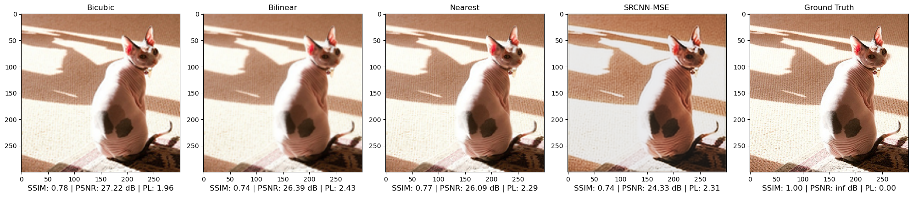
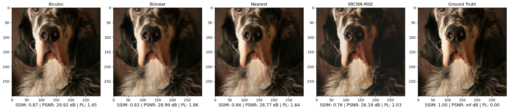
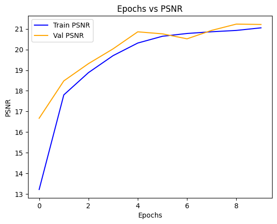
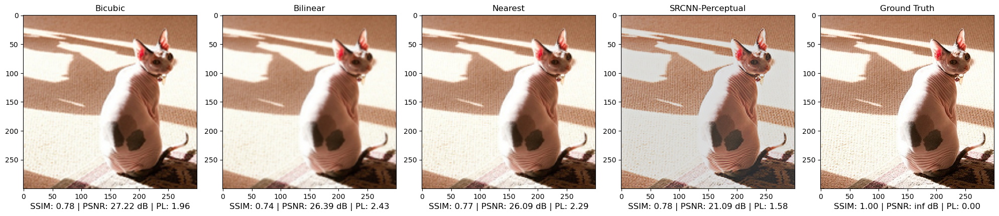
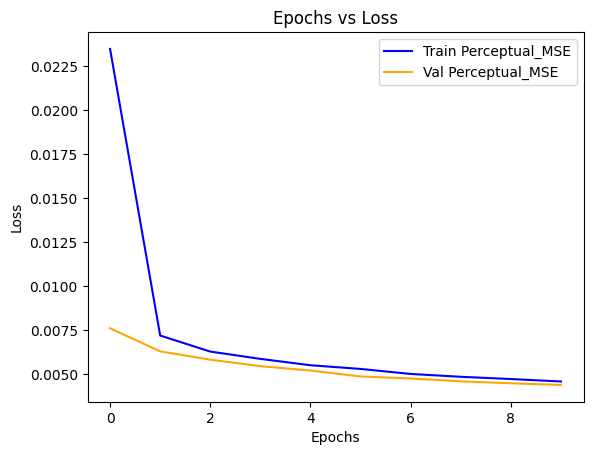
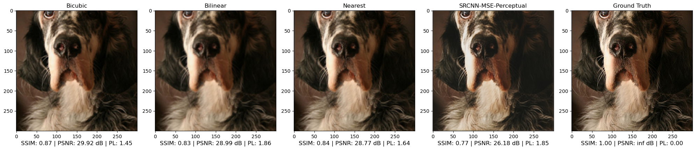
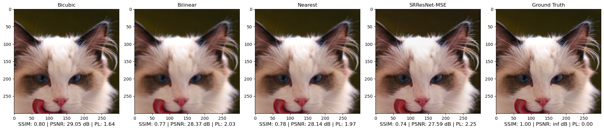
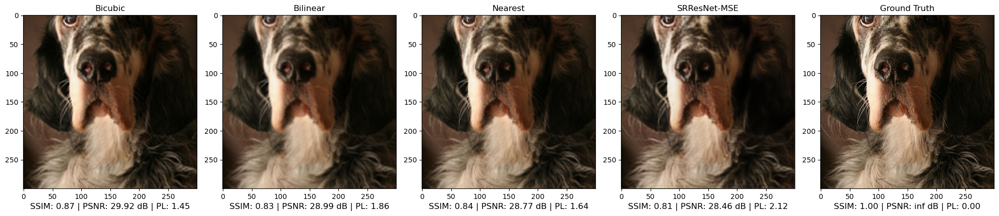
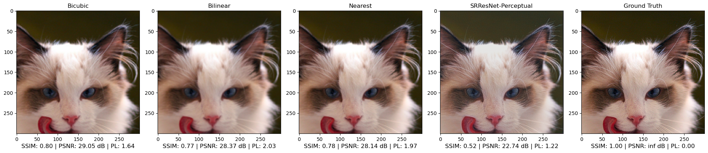
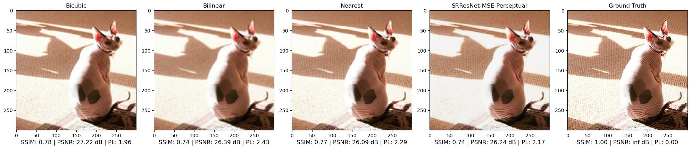

# Super Resolution

- [Introduction](#introduction)
- [Dataset](#dataset)
- [Model Architectures](#model-architectures)
   - [SRCNN](#srcnn)
   - [SRResNet](#srresnet)
- [Loss Functions](#loss-functions)
   - [MSE Loss](#mse-loss)
   - [Perceptual Loss](#perceptual-loss)
   - [MSE with Weighted Perceptual Loss](#mse-with-weighted-perceptual-loss)
- [Metrics](#metrics)
   - [Peak Signal to Noise Ratio (PSNR)](#peak-signal-to-noise-ratio-psnr)
   - [Structural Similarity Index Measure (SSIM)](#structural-similarity-index-measure-ssim)
- [Common Hyper-parameters](#common-hyper-parameters)
- [SRCNN](#srcnn-1)
   - [MSE Loss (SRCNN)](#mse-loss-srcnn)
   - [Perceptual Loss (SRCNN)](#perceptual-loss-srcnn)
   - [MSE with Weighted Perceptual Loss (SRCNN)](#mse-with-weighted-perceptual-loss-srcnn)
- [SRResNet](#srresnet-1)
   - [MSE Loss (SRResNet)](#mse-loss-srresnet)
   - [Perceptual Loss (SRResNet)](#perceptual-loss-srresnet)
   - [MSE with Weighted Perceptual Loss (SRResNet)](#mse-with-weighted-perceptual-loss-srresnet)

# Introduction
This a comparative study of different models on the computer vision task of super resolution. Super-resolution is the of upscaling a low resolution image into a high resolution one by a factor of $n$. For this project, I used $n=2$.

I used the Oxford-IIIT Pet Dataset to train our models.

I used two separate model architectures for this:
- A vanilla **Super Resolution Convolutional Neural Network** (SRCNN).
- A **Super Resolution Residual Network** (SRResNet).

I paired each of them up wtih two three different loss functions to compare the results. Them being:
- MSE Loss
- Perceptual Loss with a pre-trained VGG-16 
- MSE Loss with Weighted Perceptual Loss.

Finally the metrics I used to evaluate these models:
- Peak Signal to Noise Ratio  (PSNR)
- Structural Similarity Index SSIM (SSIM).
# Dataset
I used the [Oxford-IIIT Pet Dataset](https://www.robots.ox.ac.uk/~vgg/data/pets/data/images.tar.gz) for training the models.

# Model Architectures
## SRCNN
Model Architecture:
```
Bicubic-Interpolation
Sequential(
  (0): Conv2d(3, 64, kernel_size=(9, 9), stride=(1, 1), padding=(4, 4))
  (1): Conv2d(64, 32, kernel_size=(5, 5), stride=(1, 1), padding=(2, 2))
  (2): Conv2d(32, 32, kernel_size=(3, 3), stride=(1, 1), padding=(1, 1))
  (3): Conv2d(32, 3, kernel_size=(5, 5), stride=(1, 1), padding=(2, 2))
  (4): Sigmoid()
)
```
Model summary with `(1,3,300,300)` input:
```
==========================================================================================
Layer (type:depth-idx)                   Output Shape              Param #
==========================================================================================
SRCNN                                    [1, 3, 600, 600]          --
├─Sequential: 1-1                        [1, 3, 600, 600]          --
│    └─Conv2d: 2-1                       [1, 64, 600, 600]         15,616
│    └─Conv2d: 2-2                       [1, 32, 600, 600]         51,232
│    └─Conv2d: 2-3                       [1, 32, 600, 600]         9,248
│    └─Conv2d: 2-4                       [1, 3, 600, 600]          2,403
│    └─Sigmoid: 2-5                      [1, 3, 600, 600]          --
==========================================================================================
Total params: 78,499
Trainable params: 78,499
Non-trainable params: 0
Total mult-adds (G): 28.26
==========================================================================================
```
## SRResNet
Model Architecture:
```Sequential(
  (0): Conv2d(3, 64, kernel_size=(5, 5), stride=(1, 1), padding=(2, 2))
  (1): Sequential(
    (0): ResidualBlock(
      (conv1): Conv2d(64, 32, kernel_size=(1, 1), stride=(1, 1))
      (conv2): Conv2d(32, 64, kernel_size=(1, 1), stride=(1, 1))
      (relu): ReLU(inplace=True)
    )
    (1): ResidualBlock(
      (conv1): Conv2d(64, 32, kernel_size=(1, 1), stride=(1, 1))
      (conv2): Conv2d(32, 64, kernel_size=(1, 1), stride=(1, 1))
      (relu): ReLU(inplace=True)
    )
    (2): ResidualBlock(
      (conv1): Conv2d(64, 32, kernel_size=(1, 1), stride=(1, 1))
      (conv2): Conv2d(32, 64, kernel_size=(1, 1), stride=(1, 1))
      (relu): ReLU(inplace=True)
    )
    (3): ResidualBlock(
      (conv1): Conv2d(64, 32, kernel_size=(1, 1), stride=(1, 1))
      (conv2): Conv2d(32, 64, kernel_size=(1, 1), stride=(1, 1))
      (relu): ReLU(inplace=True)
    )
  )
  (2): Conv2d(64, 32, kernel_size=(3, 3), stride=(1, 1), padding=(1, 1))
  (3): Sequential(
    (0): SubPixelConv(
      (conv): Conv2d(32, 128, kernel_size=(3, 3), stride=(1, 1), padding=(1, 1))
      (relu): ReLU(inplace=True)
      (pixle_shuffle): PixelShuffle(upscale_factor=2)
    )
  )
  (4): Conv2d(32, 3, kernel_size=(3, 3), stride=(1, 1), padding=(1, 1))
  (5): Sigmoid()
)
```
Model summary with `(1,3,300,300)` input:
```
==========================================================================================
Layer (type:depth-idx)                   Output Shape              Param #
==========================================================================================
SRResNet                                 [1, 3, 600, 600]          --
├─Sequential: 1-1                        [1, 3, 600, 600]          --
│    └─Conv2d: 2-1                       [1, 64, 300, 300]         4,864
│    └─Sequential: 2-2                   [1, 64, 300, 300]         --
│    │    └─ResidualBlock: 3-1           [1, 64, 300, 300]         4,192
│    │    └─ResidualBlock: 3-2           [1, 64, 300, 300]         4,192
│    │    └─ResidualBlock: 3-3           [1, 64, 300, 300]         4,192
│    │    └─ResidualBlock: 3-4           [1, 64, 300, 300]         4,192
│    └─Conv2d: 2-3                       [1, 32, 300, 300]         18,464
│    └─Sequential: 2-4                   [1, 32, 600, 600]         --
│    │    └─SubPixelConv: 3-5            [1, 32, 600, 600]         36,992
│    └─Conv2d: 2-5                       [1, 3, 600, 600]          867
│    └─Sigmoid: 2-6                      [1, 3, 600, 600]          --
==========================================================================================
Total params: 77,955
Trainable params: 77,955
Non-trainable params: 0
Total mult-adds (G): 7.25
==========================================================================================
```
**Note:** I used a $1\times 1$ bottleneck layer for the residual blocks for faster computation.

I made the models have roughly the same amount parameters to have a fairer comparison.
# Loss Functions
## MSE Loss
Vanilla pixel-wise mean-squared loss.
$$\mathcal{L}_{MSE}=\frac{1}{h\times\ w\times c}||\mathbf{x}_r-\mathbf{x}_u||^2_2$$
where,

$\mathbf{x}_r$ : Ground truth image.

$\mathbf{x}_u$ : Upscaled image.

$h$ : Height of the image.

$w$ : Width of the image.

$c$ : Channels in the image.

## Perceptual Loss
Feature wise mean-squared loss extracted from different layers of a pretrained classification model.

$$\mathcal{L}_{Perceptual}=\sum_{l}\frac{1}{h^{(l)}\times\ w^{(l)}\times c^{(l)}}||\mathbf{f}_r^{(l)}-\mathbf{f}_u^{(l)}||^2_2$$
where,

$\mathbf{f}_r^{(l)}$ : Features of ground truth image of $l$'th layer.

$\mathbf{f}_u^{(l)}$ : Features of upscaled image of $l$'th layer.

$h^{(l)}$ : Height of the features in $l$'th layer.

$w^{(l)}$ : Width of the features in $l$'th layer.

$c^{(l)}$ : Channels of the features in $l$'th layer.

## MSE with Weighted Perceptual Loss

$$\mathcal{L}_{Perceptual-MSE}=\mathcal{L}_{MSE}+\lambda\mathcal{L}_{Perceptual}$$
where,

$\lambda$ : Weight associated with Perceptual Loss.

# Metrics
## Peak Signal to Noise Ratio (PSNR)
PSNR quantifies the level of distortion or noise introduced in the image processing pipeline, providing insight into the perceptual quality experienced by viewers. 
$$PSNR = 10\log_{10}\left(\frac{MAX^2}{\mathcal{L}_{MSE}}\right)$$
where,

$MAX$ : Represents maximum value a pixel can take.

## Structural Similarity Index Measure (SSIM)
Unlike traditional metrics, SSIM is designed to provide a more perceptually relevant measure by taking into account changes in structural information, luminance, and contrast.
$$SSIM(\mathbf{x},\mathbf{y})=
\frac{(2\mu_{\mathbf{x}}\mu_\mathbf{y}+C_1)(2\sigma_{\mathbf{x}\mathbf{y}}+C_2)}
{(\mu^2_\mathbf{x}+\mu^2_\mathbf{y}+C_1)(\sigma^2_\mathbf{x}+\sigma^2_\mathbf{y}+C_2)}$$
where,
- $\mu_{\mathbf{x}}$ and $\mu_{\mathbf{y}}$ are the average intensities of $\mathbf{x}$ and $\mathbf{y}$.
- $\sigma_{\mathbf{x}}$ and $\sigma_{\mathbf{y}}$ are variances of $\mathbf{x}$ and $\mathbf{y}$.
- $\sigma_{\mathbf{x}\mathbf{y}}$ is covariance of $\mathbf{x}$ and $\mathbf{y}$.


# Common Hyper-parameters
Before delving into the performance of each model, let's look at some of the common hyper-parameters of our models.
- **Upscale Factor**: `2`
- **Image size**: `(None,3,300,300)`. Performed random crop and padding to our images to achieve similar size.
- **Optimizer**: `Adam`
- **Learning Rate**: `1e-4`
- **Epochs**: `10`
- **Batch Size**: `32`
- **Train, Val, Test Split**: `0.8,0.1,0.1`

# SRCNN 

## MSE Loss (SRCNN)
### Plots


### Test Metrics
- **PSNR**: `26.1032 dB`
- **SSIM**: `0.7731`

### Some Images




## Perceptual Loss (SRCNN)
### Hyperparameters
- **Perceptual Model**: `VGG-16`
- **Feature Extraction Layers**: `(3,8,15,29)` as mentioned [here](https://arxiv.org/pdf/2302.04032.pdf).
### Plots



### Test Metrics
- **PSNR**: `21.6850 dB`
- **SSIM**: `0.7605`

### Some Images



## MSE with Weighted Perceptual Loss (SRCNN)
### Hyperparameters
- **Perceptual Model**: `VGG-16`
- **Feature Extraction Layers**: `(3,8,15,29)`
- **Perceptual Loss Weight** ($\lambda$) : `0.001`. Took this value so that MSE Loss and Perceptual Loss can have approximately weight.

### Plots



### Test Metrics
- **PSNR**: `26.0233 dB`
- **SSIM**: `0.7797`

### Some Images





# SRResNet
## MSE Loss (SRResNet)
### Plots


### Test Metrics
- **PSNR**: `28.2696 dB`
- **SSIM**: `0.7989`

### Some Images




## Perceptual Loss (SRResNet)
### Hyperparameters
- **Perceptual Model**: `VGG-16`
- **Feature Extraction Layers**: `(3,8,15,29)`
### Plots


### Test Metrics
- **PSNR**: `22.7536 dB`
- **SSIM**: `0.5199`

### Some Images




## MSE with Weighted Perceptual Loss (SRResNet)
### Hyperparameters
- **Perceptual Model**: `VGG-16`
- **Feature Extraction Layers**: `(3,8,15,29)`
- **Perceptual Loss Weight** ($\lambda$) : `0.001`

### Plots


### Some Images



### Test Metrics
- **PSNR**: `28.8381 dB`
- **SSIM**: `0.8170`


